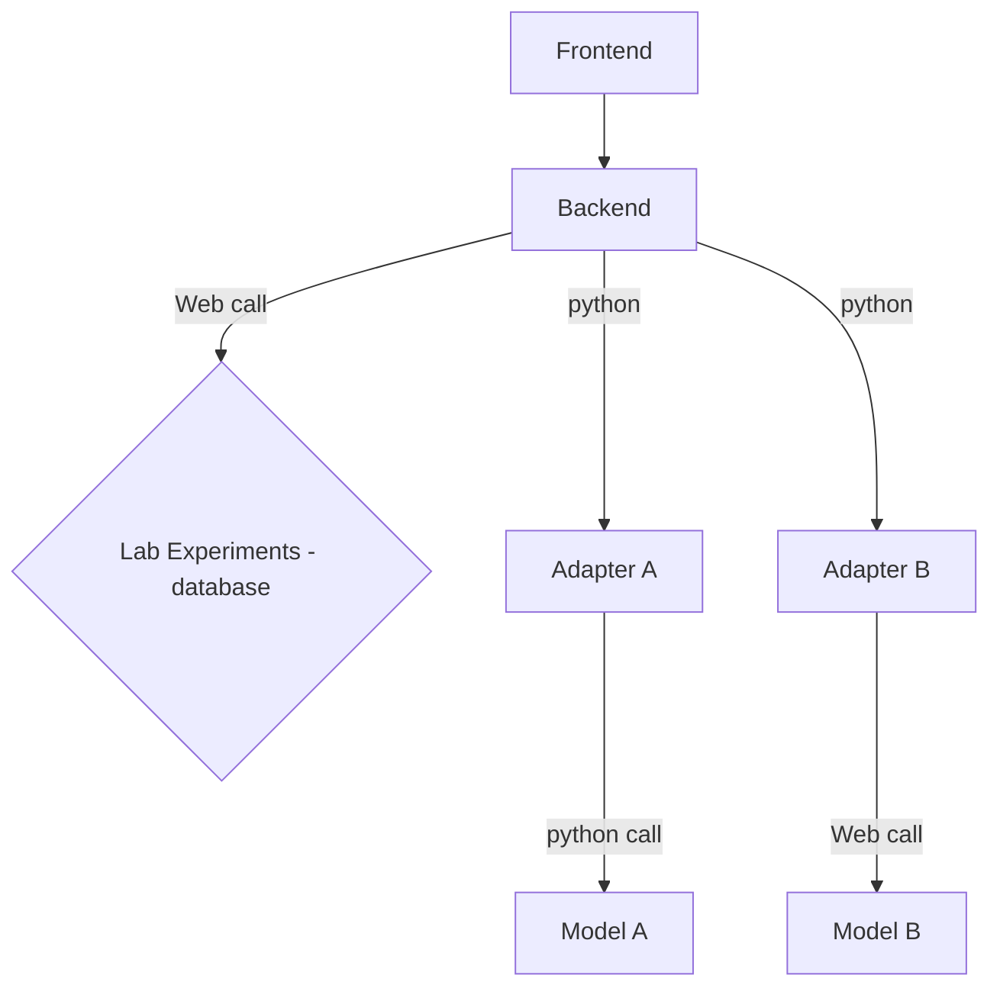

# Architecture Decision Record for AcidWatch

## Context and Problem statement

- Models are integrated purely through a web api. The decision where to put the mapping between
  AcidWatch and the model is not consistent. For arcs it is done in a fork, while for co2spec it is
  done inside the repository (but mainly because we build it). Considering another model, such as
  reactorio, would it be another fork?
- We force AcidWatch web specification upon other models that should not know about AcidWatch. In
  the case that the api breaks, all models must update their api, and hence other clients could
  break as well.
- We want to narrow down where the interfaces towards the different models reside. If we want to
  break the AcidWatch api for calling models we would like to reduce the impact as much as possible.
- Handling of data in the frontend is not consistent, as it for instance knows about something
  called Oasis (database for experimental data), and logic based on model names exist in frontend.
  We want the business logic of where things are stored and how it is called to be in a smallest
  possible location.
- Integration of models are leaking to different locations in AcidWatch.

## Proposal

* Bundled: Bundle all models together with AcidWatch
* Web only: Keep all Models through web API (Current setup)
* Hybrid: Allow for both bundling and web api

## Pros and Cons

### Bundled

* Good, because it reduces complexity considerably
* Good, as it will be easier to do iterations on API
* Good, avoid having web apis unnecessarily

* Bad, because possible incompatible python dependencies for models
* Bad, if the model is not public it will be difficult to protect it when bundled.
* Bad, could be difficult to scale with high compute models

### Web only

* Good, as it allows flexibility in terms of how it is built (language agnostic)
* Good, allows for authn and authz.
* Good, easier to scale

* Bad, requires a web server regardless (even for simple python calls)
* Bad, spreads the implementation into different locations.

### Hybrid

* Good, allows for using the solution that fits (all goods above)
* Good, possible to change which solution to use (bundled doesn't work, go for web api)

* Bad, as also the bad points above can occur.

## Decision Outcome

We have chosen option "Hybrid", which allows for more flexibility in how we integrate models. At the
same time it makes it more important to specify how the integration is done, hence we have included
this process in the ADR.

Interface between AcidWatch and calculation models will be defined in Adapters. The Adapters will
reside in the AcidWatch repository as part of the backend.

The authors of AcidWatch will maintain the adapters - but not necessarily the models. Currently that is
the CCS Data & Digital Team.

We require that there will be interaction in the AcidWatch repository in order to add a
new model, as an adapter must be implemented for the model to be integrated.

## Appendix - Architecture

### Frontend

General (dumb) frontend, only knows about AcidWatch API. Has no notion about the specific models.
Knows that the API can provide models (which describes the data they need), has a way to run
calculation, a way to store data and retrieve data. Integrations of models can be handled in
different manners:

### Backend

The AcidWatch API is an integration layer. It's main purpose is to integrate the different models
into something that is easy to use for the Frontend. It should also take care of state, such as
storing input values and results, usage logging and access control. This is also where we can
implement resilience and fault-handling.

### Adapters

We use a set of Adapters to interface between the models. The adapters will be written in Python
(for simplicity of incorporating into the backend), and AcidWatch Backend will have the template. We
create a BaseClass that all adapters must inherit from, which contains required functions. The
adapters will reside in the AcidWatch Backend. Implementation details is up to the authors of the
adapters as long as they follow the BaseClass, but it must remain purely inside the adapter and must
not leak out.

Models can be integrated in different ways. Consider the following:

- Simple and lightweight can be embedded in the AcidWatch API as a python dependency.
- Models that are more computationally heavy or need to be separated for other reasons should have
  their own web API.


An adapter must be implemented per model. For option 1, the adapter can be importing the package
and calling the calculation directly. For option 2, the adapter can call a web API.

This means that we allow models to be installed together with AcidWatch Image (see Dockerfile).

We might need to revisit this issue if we exhibit scaling issues (that is, calling a model that will
run the calculations on the server hosting the backend could end in performance issues). Currently
we do not set any requirements on calculation time for models.

## User Stories - basis for decision

### User story for Integrating

I am a model developer and want to integrate model in AcidWatch. I want maintainers of repository to
maintain the integration after I am done.

Steps:
1. Git clone Acidwatch repo
2. Use docker compose to start a local instance
3. Create a new adapter in backend from a template
4. Implement model config and simulation_run in adapter
5. See that new model appears in local acidwatch
6. Run model in local acidwatch
7. There is an error in the implementation, but AcidWatch captures the error with a try-except and
   displays to the user
8. Run AcidWatch's generic model smoke pytest, that automatically includes the user's new model
9. User fixes error, submits a new PR that gets merged!

### User story for using models directly

I am a developer of a different application. I want to run different models, but avoid having to
handle all the different interfaces of the models. Luckily, I see that AcidWatch exposes an API. I
am that it is well documented and easy to use!

Steps:
1. Access the API documentation of AcidWatch (backend)
2. Have a way of asking which models are available
3. Call the AcidWatch API for each available model and analyse the results

NB: used a trimmed version of [adr template](https://github.com/adr/madr/blob/4.0.0/template/adr-template.md?plain=1).
